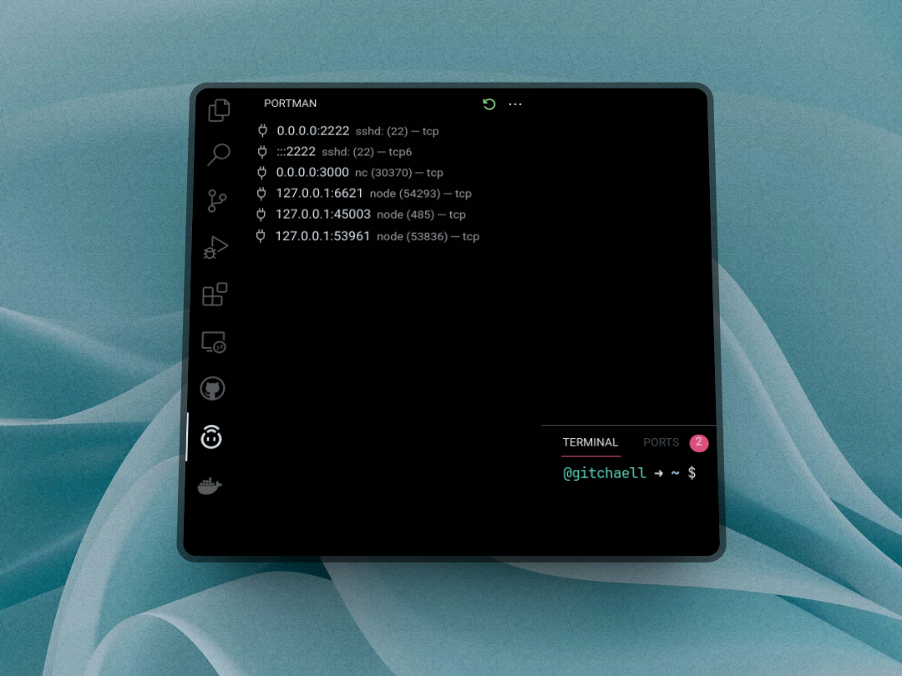

# Portman

Manage processes/ports running on your computer.

## View and refresh all running processes

## View details of each process

## Kill processes from activities bar

## Search and kill processes from prompt

