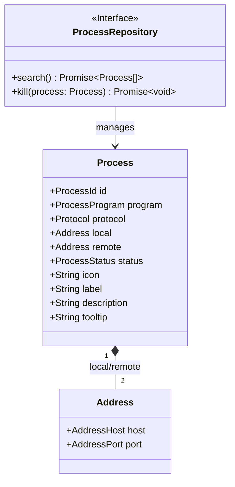

  

<h1 align="center">
  Análisis Arquitectónico de Portman: Gestión de Procesos de Red en VS Code
</h1>

Este documento expone la arquitectura, el diseño de dominio y los flujos de ejecución que fundamentan **Portman**, una extensión nativa para Visual Studio Code. Su propósito es actuar como registro técnico oficial del repositorio y como caso de estudio descriptivo de las decisiones de ingeniería detrás del proyecto.

[📸 Captura: Vista principal de Portman mostrando la jerarquía de procesos activos en el panel lateral de VS Code]

---

## Contexto del Problema y Mecánica de Resolución

Durante el desarrollo de software, un obstáculo operativo recurrente es la colisión de asignación de puertos de red (conocido en entornos Node.js como el error `EADDRINUSE`). Esto ocurre cuando un proceso previo, ya sea en ejecución intencionada o huérfano (zombie), mantiene abierto un *socket* de escucha en una interfaz de red y puerto específicos, impidiendo que una nueva instancia se enlace a dicho recurso.

La resolución manual de este estado requiere que el desarrollador interactúe directamente con el sistema operativo a través de una interfaz de línea de comandos (CLI) para:
1.  **Sondear:** Ejecutar utilidades de análisis de red (ej. `lsof`, `netstat`, `ss`).
2.  **Filtrar:** Procesar la salida estándar (stdout) para aislar el proceso anclado al puerto conflictivo.
3.  **Identificar:** Extraer el Identificador de Proceso (PID).
4.  **Terminar:** Enviar una señal del sistema (como `SIGKILL`) al PID identificado.

### La Solución Operativa de Portman

Portman automatiza y abstrae este flujo de diagnóstico e intervención, integrándolo directamente en el entorno de desarrollo integrado (IDE).

El flujo de trabajo funcional se resume en:
1.  **Extracción de Estado del Sistema:** La extensión interactúa de manera transparente con las APIs y binarios nativos del sistema operativo anfitrión para recuperar el estado actual de las conexiones de red.
2.  **Transformación y Mapeo:** La información cruda extraída del sistema operativo se normaliza en modelos de dominio estructurados.
3.  **Presentación en Tiempo Real:** Los modelos normalizados se renderizan en una estructura de árbol interactiva dentro de la interfaz gráfica de VS Code.
4.  **Ejecución de Acciones:** Mediante comandos integrados, la herramienta permite al usuario seleccionar un nodo del árbol y despachar la señal de terminación al proceso subyacente de forma unificada, independientemente del sistema operativo utilizado.

---

## Análisis Técnico: Arquitectura y Modelos

Para garantizar que el ciclo de vida del software soporte un crecimiento sostenible, testabilidad aislada y adaptabilidad transversal a múltiples sistemas operativos (Linux, macOS, Windows), he diseñado la estructura del proyecto bajo los principios de la **Arquitectura Limpia (Clean Architecture)** y el **Diseño Guiado por el Dominio (Domain-Driven Design - DDD)**.

El código se divide conceptualmente en cuatro capas concéntricas, donde la dependencia fluye estrictamente hacia el centro (el Dominio).

```mermaid
graph TD
    subgraph "Capa Externa (Infraestructura y Presentación)"
        VS[VS Code Extension API]
        CLI[OS Binaries: netstat, lsof, ss]
    end

    subgraph "Capa de Presentación (Presentation)"
        PTD[ProcessTreeDataProvider]
        Cmds[Commands: KillProcessCommand]
    end

    subgraph "Capa de Aplicación (Application)"
        SP[UseCase: SearchProcesses]
        KP[UseCase: KillProcess]
    end

    subgraph "Capa de Dominio (Domain)"
        Model[Aggregate Root: Process]
        RepoInt[Interface: ProcessRepository]
    end

    VS --> PTD
    VS --> Cmds
    PTD --> SP
    Cmds --> KP
    SP --> RepoInt
    KP --> RepoInt
    RepoInt <.. CLI : Implementation Details

    classDef default fill:#f9f9f9,stroke:#333,stroke-width:1px;
    classDef domain fill:#d4edda,stroke:#28a745,stroke-width:2px;
    classDef app fill:#cce5ff,stroke:#007bff,stroke-width:2px;
    classDef pres fill:#fff3cd,stroke:#ffc107,stroke-width:2px;

    class Model,RepoInt domain;
    class SP,KP app;
    class PTD,Cmds pres;
```

### 1. El Núcleo de Dominio (Domain)

El modelo de dominio está aislado de cualquier dependencia externa, framework o detalle del sistema operativo. Su objetivo principal es modelar la abstracción de un proceso de red.

#### El Agregado `Process`

La entidad central es `Process`, que actúa como el *Aggregate Root*. Está compuesto por múltiples Objetos de Valor (*Value Objects*) que garantizan la integridad de los datos en el momento de su instanciación:

*   **`ProcessId`**: Identificador único (PID).
*   **`ProcessProgram`**: Nombre del ejecutable o daemon.
*   **`Protocol`**: Protocolo de transporte (TCP, UDP).
*   **`Address`**: Composición de `AddressHost` (IP o hostname local/remoto) y `AddressPort` (puerto numérico).
*   **`ProcessStatus`**: Estado actual de la conexión (ej. LISTEN, ESTABLISHED).

```mermaid
classDiagram
    class Process {
        +ProcessId id
        +ProcessProgram program
        +Protocol protocol
        +Address local
        +Address remote
        +ProcessStatus status
        +String icon
        +String label
        +String description
        +String tooltip
    }

    class Address {
        +AddressHost host
        +AddressPort port
    }

    class ProcessRepository {
        <<Interface>>
        +search() Promise~Process[]~
        +kill(process: Process) Promise~void~
    }

    Process "1" *-- "2" Address : local/remote
    ProcessRepository --> Process : manages
```

Además, el dominio define el contrato `ProcessRepository`, que establece las operaciones fundamentales de búsqueda y terminación que el sistema requiere, sin dictar *cómo* se implementan.

### 2. Capa de Aplicación (Application)

La capa de aplicación orquesta las reglas de negocio utilizando los contratos del dominio. Está estructurada en torno a Casos de Uso específicos (*Use Cases*):
*   **`SearchProcesses`**: Emite una consulta (Query) al repositorio para recuperar el arreglo de objetos `Process`.
*   **`KillProcess`**: Emite un comando (Command) al repositorio para eliminar un objeto `Process` específico.

Estos casos de uso carecen de estado y dependen de la inyección del repositorio concreto en tiempo de ejecución.

### 3. Capa de Infraestructura (Infrastructure)

Aquí residen las implementaciones técnicas de la interfaz `ProcessRepository`. La inyección de dependencias se gestiona en el punto de entrada de la aplicación (`extension.ts`), evaluando la variable de entorno `process.platform` para instanciar el adaptador correcto.

*   **`LinuxProcessRepository`**: Prioriza la extracción mediante `netstat`. Posee un mecanismo de control de fallos (*graceful fallback*) hacia el binario `ss` si el primero no está presente. Además, evalúa la configuración `portman.linux.asRootUser` para escalar privilegios mediante `pkexec` o `sudo` en caso de requerirse.
*   **`MacProcessRepository`**: Interactúa de manera nativa con `lsof -i -P -n`.
*   **`WindowsProcessRepository`**: Invoca implementaciones basadas en PowerShell (`Get-NetTCPConnection`) o comandos MS-DOS heredados (`netstat -a -b -n -o`).

Cada repositorio delega el análisis sintáctico de la salida estándar a clases transformadoras específicas (e.g., `MacNetstatProcessTransformer`), las cuales parsean las cadenas de texto crudas, validan la estructura y mapean los datos al objeto de dominio `Process`.

### 4. Capa de Presentación (Presentation)

Esta capa aísla la lógica de negocio de la API extensiva de Visual Studio Code.
El componente principal es el **`ProcessTreeDataProvider`**, que implementa la interfaz `TreeDataProvider` de VS Code. Su responsabilidad es suscribirse a los eventos del IDE, consumir el caso de uso `SearchProcesses` y transformar el arreglo de entidades `Process` en instancias de `ProcessTreeItem` (o `ProcessQuickPickItem`) para el renderizado final del árbol visual en la Interfaz de Usuario. También gestiona la captura y presentación de errores operacionales a través de cuadros de diálogo integrados en el editor.

---

## Stack Tecnológico

La pila de herramientas elegida para este proyecto refleja la necesidad de construir un artefacto empaquetado optimizado, fuertemente tipado y estrechamente vinculado a un entorno de ejecución Node.js (Electron).

| Tecnología / Herramienta | Rol en la Arquitectura | Propósito Funcional |
| :--- | :--- | :--- |
| **TypeScript (v5.x)** | Lenguaje Principal | Provee análisis estático y tipado fuerte, crucial para modelar las entidades de la capa de Dominio y asegurar contratos entre capas. |
| **VS Code Extension API** | Entorno de Ejecución | Provee la interfaz programática (`vscode.*`) para la renderización de la UI nativa, el registro de comandos y el acceso al panel lateral. |
| **Webpack (v5.x)** | Empaquetador / Bundler | Combina, transpila y minifica el código fuente en un archivo `extension.js` optimizado, reduciendo la latencia de activación del plugin. |
| **Mocha & Electron Test**| Suite de Pruebas | Orquesta las pruebas de integración (`xvfb-run npm test`) ejecutando una instancia *headless* del editor para verificar el flujo completo de los casos de uso. |

---

## Conclusión Técnica

La adopción estricta de una Arquitectura Limpia en un proyecto de extensión para un IDE, un entorno característicamente acoplado a la vista, ha resultado en una separación absoluta de las responsabilidades. El núcleo lógico de resolución de dependencias de red ignora completamente tanto el sistema operativo subyacente como el marco de presentación de VS Code. Esta abstracción garantiza que las integraciones nativas puedan modificarse, optimizarse o sustituirse (e.g. transicionar de comandos CLI a invocaciones de kernel en C++) sin generar efectos secundarios en las reglas de negocio o en la lógica de presentación del flujo de trabajo de terminación de puertos.
